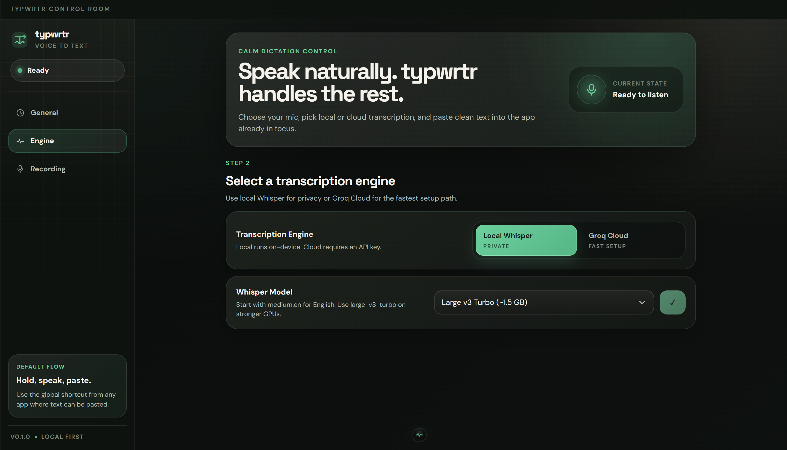

# typwrtr

<p align="center">
  
</p>

<p align="center">
  <strong>Speak anywhere. Transcribe locally or in the cloud. Paste into the app you are already using.</strong>
</p>

<p align="center">
  
  
  
  
  
  
  
</p>

<p align="center">
  
</p>

`typwrtr` is a cross-platform desktop dictation app built with Tauri. It records microphone audio from a global hotkey, transcribes speech with either an in-process `whisper.cpp` (via the `whisper-rs` crate) or Groq Cloud, runs a self-learning loop to fix recurring mistakes, and pastes the cleaned-up text into the currently focused app.

> Building this on your own laptop? Start with [docs/skill.md](docs/skill.md). It tells you which setup path to use for your OS, CPU, GPU, and model choice.

## Why It Matters

- Dictate into any focused app instead of typing manually.
- Use **local Whisper** when privacy and offline transcription matter — model lives in-process, no shell sidecar, GPU-accelerated where available.
- Use **Groq Cloud** when you want the fastest setup with fewer native build steps.
- Self-learning: correct a transcription once with a hotkey and typwrtr biases future inferences toward your jargon, names, and homophones.
- Per-app profiles: VS Code gets the technical-vocabulary prompt; Slack gets default; both stay out of each other's way.
- Voice commands inline (`new line`, `period`, `cap that`, `code mode`, `clipboard instead`).
- Postprocess + optional LLM cleanup pass.
- Always-on-top heartbeat overlay: hover for status animation, click to start/stop recording.
- Streaming captions overlay during recording (opt-in).
- Snippets with `{{date}}` / `{{clipboard}}` / `{{selection}}` templating.
- Keep generated binaries, models, and build artifacts out of Git.

## Choose Your Setup

| Your machine | Recommended path | Start with |
| --- | --- | --- |
| Windows + NVIDIA GPU | Local Whisper with `cuda` feature | `medium.en`, then `large-v3-turbo` |
| Windows CPU-only | Groq Cloud or CPU local | Groq Cloud or `small.en` |
| macOS Apple Silicon | Local Whisper with `metal` feature (default) | `medium.en` |
| macOS Intel | Groq Cloud or CPU local | Groq Cloud or `small.en` |

For the full machine-specific build flow, use the reusable setup skill: [docs/skill.md](docs/skill.md).

## Quick Start

Install prerequisites:

- Node.js 20+
- Rust via `rustup`
- **LLVM / libclang** on PATH (`whisper-rs-sys` uses bindgen at build time)
  - Windows: `winget install LLVM.LLVM`, set `LIBCLANG_PATH=C:\Program Files\LLVM\bin`
  - macOS: bundled with Xcode Command Line Tools
- Windows: Microsoft C++ Build Tools and WebView2 Runtime
- macOS: Xcode Command Line Tools
- For NVIDIA GPU acceleration on Windows/Linux: CUDA Toolkit (`nvcc` on PATH)

Windows:

```powershell
npm.cmd install
npm.cmd run tauri dev
```

macOS or shells where `npm` works directly:

```bash
npm install
npm run tauri dev
```

The Tauri config starts the Vite dev server automatically at `http://localhost:1420`.

First clean build compiles `whisper.cpp` + GGML + CUDA/Metal kernels in-process; expect ~3–10 minutes. Incremental builds are seconds.

## First Launch

1. Pick your microphone.
2. Choose `Local Whisper` or `Groq Cloud`.
3. For `Groq Cloud`, paste your API key — it is stored in the OS keychain, never on disk.
4. For `Local Whisper`, download a model from the app. The model lives at `Settings → Engine → Model folder` (defaults to the app config directory; click **Select folder** to override).
5. Press a hotkey, or click the heartbeat overlay at the bottom-center of the screen, and speak into any app where text can be pasted.

Settings (minus the keyed Groq token) live under the app config directory:

| OS | App data path |
| --- | --- |
| Windows | `%APPDATA%\com.typwrtr.app` |
| macOS | `~/Library/Application Support/com.typwrtr.app` |

## Hotkeys

All three are global and configurable. They coexist — you can use Toggle and Push-to-Talk interchangeably without picking a "mode."

| Action | Default (Windows) | Default (macOS) |
| --- | --- | --- |
| Toggle recording | `Ctrl+Shift+Space` | `Cmd+Shift+Space` |
| Push-to-talk recording | `Ctrl+Shift+Enter` | `Cmd+Shift+Enter` |
| Fix-up the last transcription | `Ctrl+Shift+;` | `Cmd+Shift+;` |

**Toggle** taps once to start, taps again to stop. **Push-to-talk** records while held. The **fix-up** hotkey remains available as a manual fallback for apps typwrtr cannot inspect automatically.

## Heartbeat overlay

typwrtr creates a tiny always-on-top heartbeat control near the bottom-center of the screen:

- **Idle**: muted green heartbeat, hover animates the pulse.
- **Recording**: red throb with an active heartbeat trace.
- **Transcribing**: amber/green throb while the final pass runs.

Click the overlay to use the same toggle flow as the global hotkey: click once to start recording, click again to stop and transcribe. During transcription, clicks are ignored until the recorder returns to ready. The overlay window is non-focusable so clicking it should not steal keyboard focus from the app you are dictating into.

## Pipeline

For each dictation:

```
mic capture → resample to 16 kHz mono → whisper-rs (persistent context, GPU)
  → cleanup_text → replacement table → voice commands
  → postprocess mode → optional LLM cleanup → paste / clipboard
  → DB log (transcription, app context, latency)
```

Streaming captions tap into the same path with a 700 ms partial-inference loop and an energy-based VAD that auto-finalises a toggle-mode session after configurable silence.

## Local Whisper

The app links `whisper.cpp` directly via the `whisper-rs` crate — no shell sidecar, no `binaries/whisper-cpp.exe` to ship. The model loads once at startup and stays resident.

Models supported in the UI:

| Model | Best for |
| --- | --- |
| `base.en` | Very fast tests |
| `small.en` | CPU-only low latency |
| `small` | Multilingual low latency |
| `medium.en` | Default English dictation |
| `medium` | Multilingual balanced quality |
| `large-v3-turbo` | Higher accuracy on stronger machines |
| `large-v3` | Maximum quality when latency is acceptable |

GPU backend is wired per target in `src-tauri/Cargo.toml`:

| OS | Default backend | How to switch |
| --- | --- | --- |
| macOS | Metal | already on |
| Windows / Linux + NVIDIA | CUDA | leave the `["cuda"]` feature on the non-macOS dep line |
| Windows / Linux CPU-only | drop the feature array | `whisper-rs = "0.16"` |

The startup log line `[typwrtr] Whisper backend: CUDA/Metal/CPU` reports the compile-time target; whisper.cpp prints the actual device pick during model load (`ggml_cuda_init: found 1 CUDA devices: …`).

## Self-Learning

The preferred loop is automatic:

1. Dictate and let typwrtr paste into the focused app.
2. If the pasted text is wrong, edit it normally in that app.
3. On Windows, typwrtr checks the same focused editable control shortly after paste using UI Automation. If the edited text is highly similar to what typwrtr pasted, it learns the diff automatically.

The fix-up hotkey is still available as a fallback for apps or controls that do not expose focused text reliably. Select the wrong text and press the fix-up hotkey; typwrtr matches the selection against the most recent transcription, opens the correction window, and saves the same kind of learning signal.

For automatic and manual corrections, the diff pipeline extracts (wrong → right) pairs, attaches up to 4 words of context, and:
   - Bumps `count` on existing pairs (or inserts new ones).
   - Promotes proper-noun-shaped right-side tokens (mixed case or all caps, length ≥ 3, not a stopword) into the per-app vocabulary.

On future dictations:
- Top-20 per-app vocab + top-10 global vocab + top-10 per-app correction targets are appended to whisper's `initial_prompt` (deduped, capped at ≈800 chars to stay under whisper's ~224-token budget).
- Pairs with `count ≥ 3` fire the **replacement table** — case-insensitive, word-boundary safe, gated by a context check, applied pre-paste.

Learning data is local SQLite (`<app_dir>/typwrtr.sqlite`). The Learning tab shows top corrections and vocabulary with per-row **Forget** that tombstones the entry so it does not re-learn. **Clear all learning data** wipes the DB and the audio retention dir.

The recorder, `save_correction`, `forget_*`, and `wipe_learning_data` all emit `learning://changed`; the Learning tab updates without polling.

## App profiles (per-app tuning)

The Apps tab lists every app you have dictated into (or have an explicit profile for). Per-app:

- **Vocabulary prompt** — free text prepended to whisper's `initial_prompt`.
- **Postprocess mode** — `default`, `markdown`, `plain`, `code`.
- **Code identifier case** — `snake_case`, `camelCase`, `kebab-case` (used by `code` mode).
- **Preferred model** — overrides global model for this app only.
- **Learning enabled** — when off, no DB log and no prompt biasing for this app.
- **Auto-apply replacements** — when off, the replacement table is not applied here.

Foreground app detection uses `active-win-pos-rs`. `bundle_id` is a real CFBundleIdentifier on macOS; on Windows it is the lowercased exec basename (`code`, `slack`, `chrome`).

## Inline voice commands

Speak any of these and the recorder rewrites the transcript before paste:

| Phrase | Effect |
| --- | --- |
| `new line` / `newline` | `\n` |
| `new paragraph` | `\n\n` |
| `period` / `comma` | append punctuation, no leading space, dedup-aware |
| `question mark` | `?` |
| `exclamation point` / `exclamation mark` | `!` |
| `scratch that` / `delete that` | drop the previous sentence |
| `cap that` | uppercase the previous word |
| `all caps on` / `all caps off` | toggle state for subsequent words |
| `bullet list` | every newline gets `- ` prefix |
| `clipboard instead` | skip paste, leave text in clipboard, toast |
| `code mode` | flip on the `code` postprocess transformation for this dictation |

Acceptance test from the spec: `"Hey team comma new line we shipped the new build period"` → `"Hey team,\nwe shipped the new build."`.

## Postprocess + optional LLM cleanup

After voice commands, the text passes through the per-app postprocess mode:

- **default** — pass-through (cleanup_text already capitalised + ensured trailing punctuation).
- **plain** — strip Markdown markers (`**bold**`, `*italic*`, `` `code` ``, `# heading`, `- list`, `1. numbered`, `> quote`, `[text](url)`).
- **markdown** — preserve list markers from `bullet list` voice command.
- **code** — only fires when `code mode` was said in the same utterance; transforms text into a single identifier in the profile's case style.

Optional LLM cleanup pass runs last (`Settings → Engine → LLM cleanup pass`):

- **Off** (default).
- **Groq** — Llama-3.1-8B-instant via Groq with a fixed system prompt: *"Fix only punctuation, capitalization, and obvious dictation errors. Do not rephrase. Preserve all proper nouns and code-like tokens exactly."* — wrapped in an 800 ms timeout; identity fallback on Off / timeout / error.
- **Local** — deferred (would stage a `llama.cpp` sidecar; not shipped).

## Streaming captions + VAD auto-stop

Opt-in (`Settings → Recording`):

- **Streaming captions** — every 700 ms during recording, the partial buffer is run through whisper and emitted as `transcription://partial`. A transparent click-through HUD near the bottom of the screen displays partials in muted colour, switches to full opacity for the final, then fades 500 ms after.
- **Auto-finalize on silence** — energy-based VAD measures trailing silence on the resampled 16 kHz buffer; if it exceeds the configured threshold (0–2000 ms, default 800) AND the recording contains some speech, the recorder fires an auto-stop. Push-to-talk explicitly disables this.

Streaming uses the persistent whisper context — only state allocations, no model reloads. On a 5070 / RTX-class GPU with `large-v3-turbo`, partials run comfortably under the tick interval.

## Snippets

The Snippets tab is a CRUD list backed by SQLite. Each snippet has:

- **Trigger phrase** — case-insensitive, recognised by the same word-walker as voice commands.
- **Expansion** — multi-line text. When **dynamic** is on, the recorder substitutes:

| Token | Resolves to |
| --- | --- |
| `{{date}}` | ISO `YYYY-MM-DD` |
| `{{time}}` | `HH:MM` (24-hour, local) |
| `{{day}}` | localised weekday |
| `{{clipboard}}` | current clipboard text |
| `{{selection}}` | currently-highlighted text in any app (incurs ~400 ms copy-trick latency, only when the literal token is in some snippet) |

Four defaults seed on first run: `insert date`, `insert time`, `insert email signature`, `insert standup template`. Delete-and-they-stay-deleted.

## Privacy

- **Groq API key** lives in the OS keychain (`com.typwrtr.app` / `groq_api_key`). On migration from older configs, the plaintext is moved into the keychain and scrubbed from disk.
- **Audio retention** is off by default. When on, WAVs land in `<app_dir>/audio/<unix_ms>.wav`; **Clear all learning data** removes the directory along with the DB rows.
- **Save transcriptions** can be turned off — the recorder runs end-to-end without writing to the learning DB.
- **Per-app learning disable** — flip a profile's Learning switch off and that app contributes nothing to the DB or to prompt biasing.

## Build notes

- **First clean build** is slow (`whisper-rs-sys` compiles `whisper.cpp` + GGML + CUDA/Metal kernels). Plan for ~5–10 min cold; incrementals are seconds.
- **`LIBCLANG_PATH` is required** at build time (bindgen). Without it, `whisper-rs-sys` fails with *"Unable to find libclang"*.
- **No `whisper.cpp` sibling checkout** is needed any more — `whisper-rs-sys` vendors its own copy. Old `../whisper.cpp` directories from earlier setups are unused.
- **Database** lives at `<app_dir>/typwrtr.sqlite` (WAL mode). Migrations run on every startup; current schema version: 4.

## Generated Files

These artifacts are intentionally ignored by Git:

- `node_modules/`
- `dist/`
- `src-tauri/target/`
- `src-tauri/gen/`
- `src-tauri/icons/android/`
- `src-tauri/icons/ios/`

## Useful Commands

Frontend dev:

```powershell
npm.cmd run dev          # Vite only (hot-reload UI without Tauri)
npm.cmd run build        # Type-check + Vite build
npm.cmd run tauri dev    # Full app
```

Rust:

```powershell
cd src-tauri
cargo check
cargo test --lib         # 90+ unit tests
```

Run a one-off transcription via the dev console (with `withGlobalTauri` on):

```js
await window.__TAURI__.core.invoke("toggle_recording");
```

## Setup Skill

[docs/skill.md](docs/skill.md) is the important build guide for this repo. Use it when you are:

- Setting up typwrtr on a new laptop.
- Helping someone else build it on different hardware.
- Choosing between local Whisper and Groq Cloud.
- Deciding whether to use CPU, NVIDIA CUDA, or Apple Silicon Metal.
- Troubleshooting `LIBCLANG_PATH`, model load, or hotkey issues.

The skill is designed to be followed directly by a developer or coding agent. It keeps setup decisions tied to the actual machine instead of assuming every user has the same hardware.
